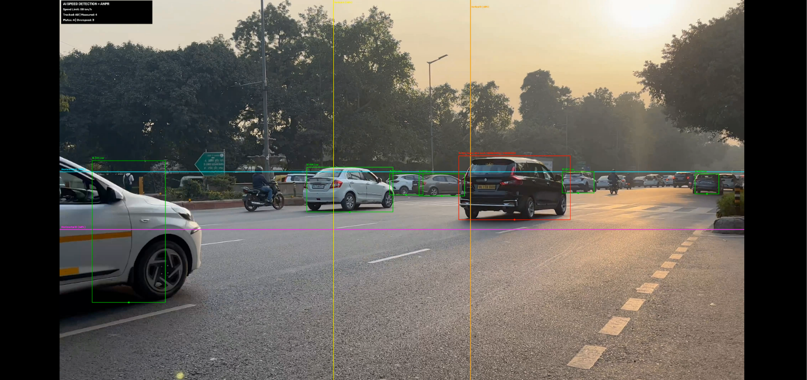
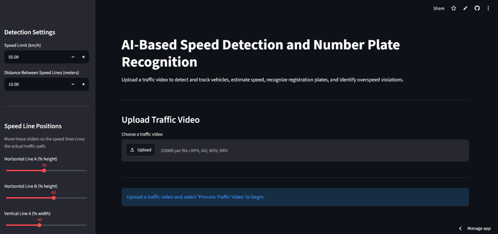
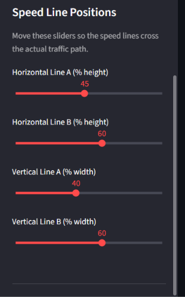
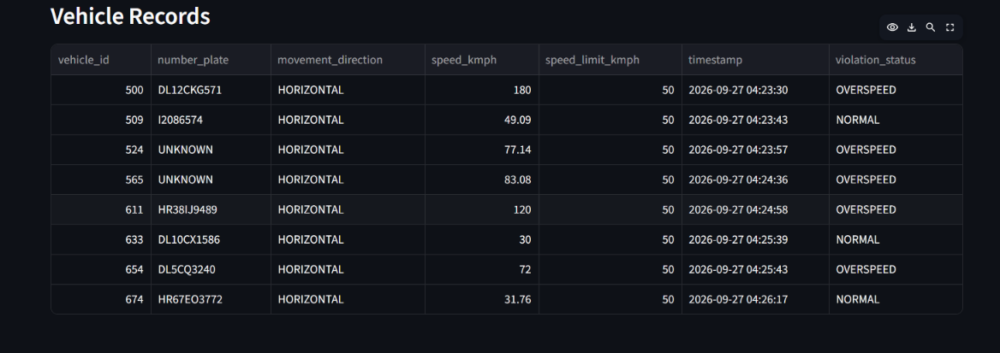
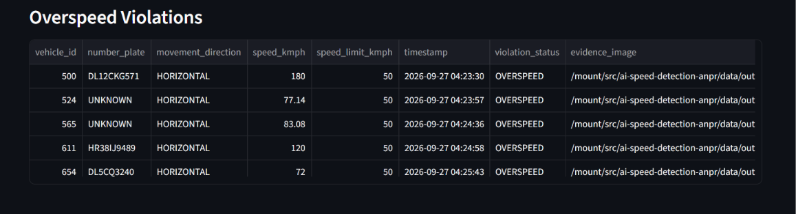

# AI-Based Vehicle Speed Detection and Automatic Number Plate Recognition

An end-to-end computer vision project for detecting and tracking vehicles, estimating speed from configurable virtual measurement lines, recognizing number plates, identifying potential overspeed events, and presenting results through a deployed Streamlit dashboard.

## Live Demo

Streamlit application:

https://ai-speed-detection-anpr-az3xnf77hxk2ejgcyh26a5.streamlit.app/

> The project is intended for education, research, and portfolio demonstration. Speed estimates are not certified for traffic enforcement.

## Demo



## Key Features

- Vehicle detection using Ultralytics YOLO
- Multi-object tracking using ByteTrack
- Horizontal and vertical traffic-motion support
- Adjustable speed-measurement lines from the Streamlit sidebar
- Configurable speed limit and inter-line distance
- Dedicated YOLO-based license-plate localization
- EasyOCR-based number-plate recognition
- Indian registration-number normalization and OCR correction
- Overspeed-event classification
- Vehicle and violation logging
- Evidence-image generation
- CSV report export
- Number-plate search
- Processed-video preview and download
- Streamlit cloud deployment

## System Pipeline

```text
Traffic Video
      |
      v
YOLO Vehicle Detection
      |
      v
ByteTrack Multi-Object Tracking
      |
      +-------------------------------+
      |                               |
      v                               v
Horizontal / Vertical            Vehicle Crop
Line-Crossing Analysis                |
      |                               v
      v                         YOLO Plate Detection
Speed Estimation                      |
      |                               v
      |                           EasyOCR
      |                               |
      |                               v
      |                      Plate Normalization
      |                               |
      +---------------+---------------+
                      |
                      v
               Speed-Limit Check
                      |
                      v
                Event Logging
                      |
                      v
              Streamlit Dashboard
```

## Example Deployment Test

A representative Streamlit test run produced:

| Metric | Result |
|---|---:|
| Vehicles tracked | 104 |
| Vehicles with completed speed measurement | 8 |
| Plates detected | 17 |
| Vehicles logged | 8 |
| Potential overspeed events | 5 |
| Vertical-traffic measurements | 0 |
| Horizontal-traffic measurements | 8 |

These numbers demonstrate that the full pipeline executed end-to-end on the selected demo video. They are **not traffic-enforcement accuracy metrics**. In this test, the configured inter-line road distance was a demonstration value and had not been physically calibrated to the scene.

## Streamlit Interface

The dashboard allows a user to upload a traffic video, set the speed limit and nominal distance between measurement lines, and tune the four virtual line positions for the camera view.



### Adjustable Speed Lines



The system supports:

- two horizontal lines for vehicles moving mainly up/down through the frame
- two vertical lines for vehicles moving mainly left/right through the frame

Whichever complete line pair a tracked vehicle crosses can be used for a speed estimate.

## Vehicle Records

Each successfully measured vehicle can be recorded with its track ID, recognized plate when available, movement direction, estimated speed, configured limit, timestamp, and status.



## Overspeed Events

Potential overspeed events are separated in the dashboard for review.



## Speed Estimation

For a vehicle that crosses both lines of a measurement pair:

```text
Speed (m/s) = Calibrated Distance (m) / Elapsed Time (s)

Speed (km/h) = Speed (m/s) × 3.6
```

The elapsed time is calculated from the tracked vehicle's line-crossing timestamps.

### Important Calibration Note

The numerical speed estimate is only meaningful when the real-world road distance represented by the two virtual lines has been measured correctly. Camera perspective, road geometry, frame rate, tracking stability, and line placement can all affect the result.

For a production-grade system, perspective-aware calibration or homography should be used.

## Number Plate Recognition

The ANPR pipeline uses a dedicated YOLO plate detector to locate license plates inside vehicle crops. Detected plate regions are then preprocessed and read using EasyOCR.

The post-processing stage normalizes OCR output and corrects common confusions in Indian-style registration numbers, for example:

```text
O / Q / D -> 0
I / L     -> 1
Z         -> 2
S         -> 5
B         -> 8
```

Corrections are applied according to the expected letter/digit positions rather than blindly replacing every character.

## Project Structure

```text
ai-speed-detection-anpr/
├── app/
│   └── streamlit_app.py
│
├── data/
│   ├── input/
│   └── output/
│
├── docs/
│   └── images/
│       ├── streamlit_dashboard.png
│       ├── speed_line_controls.png
│       ├── processed_output.png
│       ├── vehicle_records.png
│       └── overspeed_violations.png
│
├── src/
│   ├── __init__.py
│   ├── plate_detector.py
│   ├── plate_reader.py
│   ├── speed_estimator.py
│   ├── vehicle_detector.py
│   ├── vehicle_tracker.py
│   ├── violation_logger.py
│   └── web_pipeline.py
│
├── main.py
├── packages.txt
├── requirements.txt
├── .gitignore
└── README.md
```

## Technologies

- Python
- OpenCV
- Ultralytics YOLO
- ByteTrack
- EasyOCR
- ONNX Runtime
- Hugging Face Hub
- PyTorch
- NumPy
- Pandas
- Streamlit

## Installation

Clone the repository:

```bash
git clone https://github.com/amber1714/ai-speed-detection-anpr.git
cd ai-speed-detection-anpr
```

Create a virtual environment:

```bash
python -m venv .venv
```

Activate it on Windows:

```bash
.venv\Scripts\activate
```

Install Python dependencies:

```bash
pip install -r requirements.txt
```

Run the Streamlit application:

```bash
python -m streamlit run app/streamlit_app.py
```

## Streamlit Workflow

1. Upload a traffic video.
2. Set the speed limit.
3. Enter the real-world distance represented between the selected measurement lines.
4. Position the horizontal and vertical line sliders over the traffic path.
5. Process the video.
6. Review tracked vehicles, completed speed measurements, recognized plates, and potential violations.
7. Inspect the processed video and vehicle records.
8. Export the CSV report.

## Current Limitations

- Speed accuracy depends on physical calibration of the road scene.
- The simple inter-line distance model does not fully compensate for perspective.
- Tracking IDs can change when vehicles are heavily occluded.
- ANPR quality depends on plate size, visibility, lighting, viewing angle, compression, and motion blur.
- Not every tracked vehicle will necessarily cross a complete measurement-line pair.
- OCR can still produce incorrect characters or fail on low-resolution plates.
- Cloud deployment is resource constrained compared with a local GPU environment.
- The system is not certified for legal speed enforcement.

## Future Improvements

- Homography-based perspective calibration
- Per-lane calibration
- Automatic road-region and line placement
- OCR consensus across multiple frames
- Stronger plate-format validation
- Improved low-resolution plate enhancement
- Live CCTV / RTSP input
- Persistent database storage
- Real-time notifications
- Vehicle-type analytics
- User authentication
- Automated evaluation against annotated ground-truth data

## Portfolio Summary

This project demonstrates practical integration of object detection, multi-object tracking, OCR, computer vision, data processing, and cloud deployment in a single end-to-end AI application.

## Author

**Amber Rodrigues**  
M.Tech Artificial Intelligence

## Disclaimer

This project is intended for educational, research, and portfolio use. Estimated speeds and detected violations should not be treated as legally valid enforcement measurements without calibrated equipment, controlled validation, and appropriate regulatory approval.
